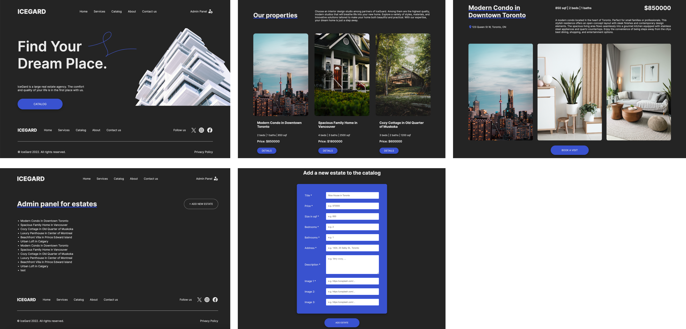

# Real Estate Agency Website

## Description
Designed and implemented a responsive web application for a Real Estate Agency using Node.js, Express framework, and Pug as the template engine. The project includes three public-facing pages (Home, Catalog, and Property pages), and integrates the MongoDB database on MongoDB Atlas as the primary data source. 

## MongoDB Integration
- Mongoose: Used for object data modeling (ODM) to interact with the MongoDB database. The schema design is as follows:
  `const EstatesSchema = new mongoose.Schema({
    title: String,
    size: Number,
    bedroom: Number,
    bathroom: Number,
    description: String,
    address: String,
    price: Number,
    image: [String]
  });
  const Estate = mongoose.model("Estate", EstatesSchema);`

- Data Storage: Stores property data in a MongoDB collection hosted on MongoDB Atlas.
- Initialize function: Helps to quickly import data to the database and populate the website with dinamically updated content

## Admin Feature
The project contains Admin functionality which allows easy addition of data to the MongoDB collection without requiring login (for now).

## Project Setup and Configuration
1. Clone the codebase
2. Install Dependencies: Install npm package manager by running `npm i` in the terminal
3. Configure MongoDB:
   - Set up a MongoDB database on MongoDB Atlas (or your preferred hosting service).
   - Create a collection for your property data.
   - Copy the connection string to access the database and use it for the next step
5. Set Environment Variables:
    - Create a .env file in the root directory and add your MongoDB credentials:
        `DBUSER=your_db_user
        DBPWD=your_db_password
        DBHOST=your_db_host`
    - Ensure your MongoDB connection URI in the application matches the format: `mongodb+srv://${process.env.DBUSER}:${process.env.DBPWD}@${process.env.DBHOST}/?{the rest of your connection string should be here}`;
6. Adjust port number in index.js if needed: `const port = process.env.PORT || "8888";`
7. Run `npm run dev` to run the project

## Design

